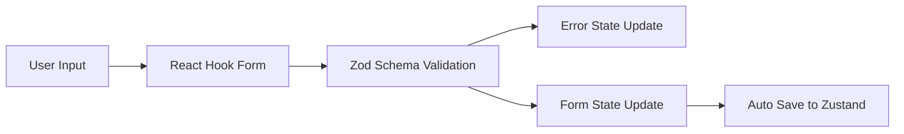
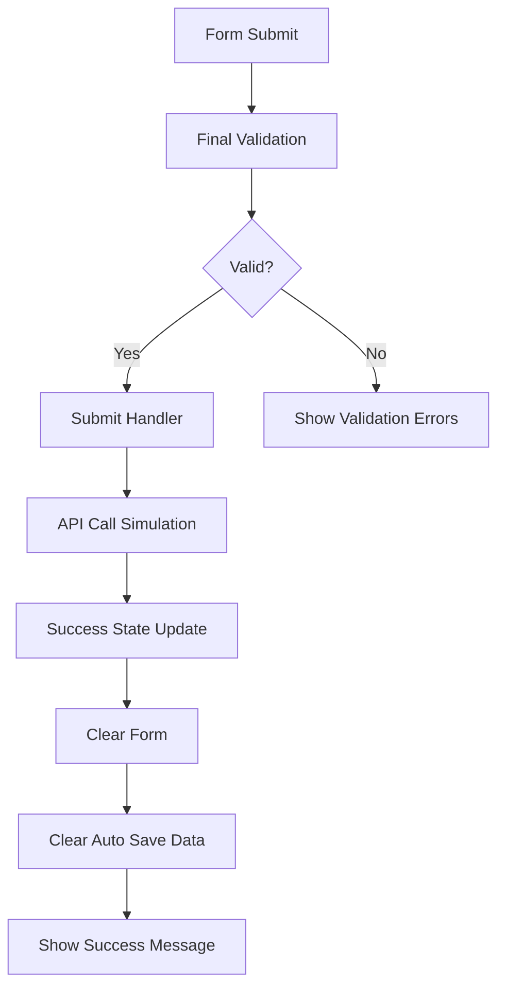

# システム設計書

## 概要

本プロジェクトは、モダンなフロントエンド開発とテスト戦略を実証する問い合わせフォームアプリケーションです。Feature-Sliced Design（FSD）アーキテクチャを採用し、Storybook 9.1とVitestの統合による包括的なテスト環境を提供しています。

## アーキテクチャ概要

### Feature-Sliced Design (FSD)

```
src/
├── app/           # アプリケーション層
│   ├── App.tsx    # ルートコンポーネント
│   ├── providers/ # グローバルプロバイダー
│   └── router/    # ルーティング設定
├── pages/         # ページ層
│   └── home/      # ホームページ
├── widgets/       # ウィジェット層
│   └── contact-form-widget/ # 問い合わせフォームウィジェット
├── features/      # 機能層
│   └── contact/   # 問い合わせ機能
│       ├── model/ # ビジネスロジック
│       ├── ui/    # UIコンポーネント
│       └── lib/   # ユーティリティ
├── entities/      # エンティティ層
│   └── contact/   # 問い合わせエンティティ
├── shared/        # 共有層
│   ├── ui/        # 共有UIコンポーネント
│   ├── lib/       # 共有ライブラリ
│   └── config/    # 設定
└── user-stories/  # ユーザーストーリー定義
```

### 技術スタック

| 領域 | 技術 | バージョン | 用途 |
|------|------|------------|------|
| **フレームワーク** | React | 18.3.1 | UIライブラリ |
| **言語** | TypeScript | 5.6.2 | 型安全性 |
| **ビルドツール** | Vite | 6.0.1 | 開発サーバー・ビルド |
| **フォームライブラリ** | React Hook Form | 7.53.2 | フォーム管理 |
| **バリデーション** | Zod | 3.23.8 | スキーマ検証 |
| **状態管理** | Zustand | 5.0.2 | アプリケーション状態 |
| **テスト** | Vitest | 3.2.4 | ユニットテスト |
| **コンポーネントテスト** | Storybook | 9.1.1 | ビジュアルテスト |
| **E2Eテスト** | Playwright | 1.49.1 | ブラウザテスト |

## コンポーネント設計

### ContactForm コンポーネント

```typescript
interface ContactFormProps {
  onSubmit?: (data: ContactFormData) => void;
  enableAutoSave?: boolean;
}
```

**責任:**
- ユーザー入力の受付
- リアルタイムバリデーション
- 自動保存機能
- 送信処理

**特徴:**
- React Hook Form + Zod Resolverによる宣言的バリデーション
- `onBlur`モードによるUX配慮
- `isSubmitting`による送信中状態管理
- ARIA属性による accessibility 対応

### Button コンポーネント（共有）

```typescript
interface ButtonProps {
  variant?: 'primary' | 'secondary' | 'danger';
  size?: 'small' | 'medium' | 'large';
  fullWidth?: boolean;
  disabled?: boolean;
  children: React.ReactNode;
  onClick?: () => void;
  type?: 'button' | 'submit' | 'reset';
}
```

## データフロー設計

### 1. 入力 → バリデーション → 状態更新



### 2. 送信フロー



## 状態管理設計（Zustand）

### ContactFormStore

```typescript
interface ContactFormStore {
  // 送信成功状態
  submitSuccess: boolean;
  setSubmitSuccess: (success: boolean) => void;
  
  // 自動保存データ
  savedData: Partial<ContactFormData> | null;
  setSavedData: (data: Partial<ContactFormData>) => void;
  clearSavedData: () => void;
  
  // テスト用リセット機能
  resetStore: () => void;
}
```

**永続化設定:**
- `localStorage`に`savedData`のみを保存
- `submitSuccess`は一時的な状態のため永続化しない
- 自動的な有効期限管理（実装可能）

## バリデーション設計

### Zodスキーマ

```typescript
export const contactFormSchema = z.object({
  name: z.string()
    .trim()
    .min(1, 'お名前は必須です')
    .max(100, '名前は100文字以内で入力してください'),
  
  email: z.string()
    .trim()
    .min(1, 'メールアドレスは必須です')
    .email('有効なメールアドレスを入力してください')
    .max(255, 'メールアドレスは255文字以内で入力してください'),
  
  subject: z.string()
    .trim()
    .min(1, '件名は必須です')
    .max(200, '件名は200文字以内で入力してください'),
  
  message: z.string()
    .trim()
    .min(10, 'お問い合わせ内容は10文字以上で入力してください')
    .max(2000, 'お問い合わせ内容は2000文字以内で入力してください'),
  
  privacyPolicy: z.boolean()
    .refine(val => val === true, 'プライバシーポリシーへの同意が必要です')
});
```

### バリデーション戦略

1. **リアルタイムバリデーション**: `onBlur`モードによる非侵入的検証
2. **型安全性**: ZodスキーマからTypeScript型を自動生成
3. **統一性**: 同一スキーマをフロントエンド・テスト・文書で共有
4. **国際化対応**: 日本語エラーメッセージ

## 自動保存機能設計

### 実装方針

```typescript
// 500ms デバウンスによる自動保存
useEffect(() => {
  if (enableAutoSave && !submitSuccess) {
    const timeoutId = setTimeout(() => {
      const hasData = Object.values(watchedValues).some(value => 
        typeof value === 'string' ? value.trim() : Boolean(value)
      );
      
      if (hasData) {
        setSavedData(watchedValues);
      }
    }, 500);
    return () => clearTimeout(timeoutId);
  }
}, [watchedValues, enableAutoSave, submitSuccess, setSavedData]);
```

### 特徴

- **デバウンス制御**: 500ms の遅延による過剰な保存を防止
- **条件付き保存**: データが存在する場合のみ保存実行
- **送信後クリア**: 正常送信完了後の自動データクリア
- **復元機能**: ページリロード後の自動データ復元

## セキュリティ設計

### 入力値検証

- **XSS対策**: React の自動エスケープ機能を活用
- **文字数制限**: 各フィールドの適切な上限設定
- **型チェック**: TypeScript + Zod による実行時型検証

### データ永続化

- **ローカルストレージ**: センシティブデータの避避
- **自動クリア**: 送信完了後のデータ削除
- **有効期限**: 将来的な実装候補

## パフォーマンス設計

### 最適化戦略

1. **遅延読み込み**: 必要時のみコンポーネント読み込み
2. **デバウンス**: 自動保存とバリデーションの制御
3. **メモ化**: 不要な再レンダリングの防止
4. **バンドル最適化**: Vite による効率的なコード分割

### メトリクス目標

- **初回読み込み**: < 2秒
- **フォーム操作応答**: < 100ms
- **バリデーション表示**: < 200ms
- **送信処理**: < 3秒

## 拡張性設計

### 将来的な機能拡張

1. **多言語対応**: i18next による国際化
2. **ファイルアップロード**: 添付ファイル機能
3. **リアルタイム通知**: WebSocket による状態同期
4. **オフライン対応**: Service Worker による offline-first

### アーキテクチャ拡張

1. **マイクロフロントエンド**: Module Federation による分散
2. **サーバーサイド**: Next.js/Remix への移行
3. **状態管理**: RTK Query による API キャッシュ
4. **テスト**: Visual Regression Testing の追加