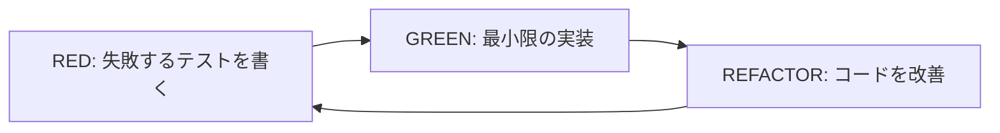

# TDD実践シナリオ集

## 🎯 TDDで新機能を追加する

既存のコンポーネントに新しい機能を追加する際のTDD実践シナリオです。

---

## シナリオ1: TodoItemに編集機能を追加

### ユーザーストーリー
```
As a タスクを管理する人
I want タスクの内容を後から修正できる
So that 間違いを直したり、詳細を追加できる
```

### 受け入れ基準
- AC-1: 各タスクに編集ボタンが表示される
- AC-2: 編集ボタンをクリックすると編集モードになる
- AC-3: 編集中はテキスト入力フィールドが表示される
- AC-4: 保存ボタンで変更を確定できる
- AC-5: キャンセルボタンで変更を破棄できる
- AC-6: 編集中は他の操作（削除・完了）ができない

### テストシナリオ（Gherkin形式）

```gherkin
Feature: TodoItem編集機能
  タスクの内容を後から修正できるようにする

  Background:
    Given TodoItemコンポーネントが表示されている
    And タスク「買い物に行く」が未完了状態で表示されている

  Scenario: 編集モードへの切り替え
    When 編集ボタンをクリックする
    Then テキスト入力フィールドが表示される
    And 入力フィールドに「買い物に行く」が表示される
    And 保存ボタンが表示される
    And キャンセルボタンが表示される
    And 編集ボタンが非表示になる
    And 削除ボタンが無効化される
    And チェックボックスが無効化される

  Scenario: タスク名の変更と保存
    Given 編集モードになっている
    When 入力フィールドの値を「スーパーで買い物」に変更する
    And 保存ボタンをクリックする
    Then タスク名が「スーパーで買い物」に更新される
    And 編集モードが終了する
    And onEditコールバックが「スーパーで買い物」で呼ばれる

  Scenario: 編集のキャンセル
    Given 編集モードになっている
    When 入力フィールドの値を「スーパーで買い物」に変更する
    And キャンセルボタンをクリックする
    Then タスク名は「買い物に行く」のまま変わらない
    And 編集モードが終了する
    And onEditコールバックは呼ばれない

  Scenario: Enterキーで保存
    Given 編集モードになっている
    When 入力フィールドの値を「スーパーで買い物」に変更する
    And Enterキーを押す
    Then タスク名が「スーパーで買い物」に更新される
    And 編集モードが終了する

  Scenario: Escapeキーでキャンセル
    Given 編集モードになっている
    When 入力フィールドの値を「スーパーで買い物」に変更する
    And Escapeキーを押す
    Then タスク名は「買い物に行く」のまま変わらない
    And 編集モードが終了する

  Scenario: 空文字での保存防止
    Given 編集モードになっている
    When 入力フィールドを空にする
    And 保存ボタンをクリックする
    Then 編集モードのまま
    And エラーメッセージは表示されない（ボタンが無効化される想定）
```

---

## シナリオ2: Counterにステップ機能を追加

### ユーザーストーリー
```
As a 大きな数値を扱いたい人
I want 増減の単位を変更できる
So that 効率的にカウントできる
```

### 受け入れ基準
- AC-1: ステップ数を選択できるセレクトボックスがある
- AC-2: 選択可能なステップ数は 1, 5, 10
- AC-3: ステップ数に応じて増減の単位が変わる
- AC-4: 最大値・最小値の制約は維持される

### テストシナリオ

```gherkin
Feature: Counterステップ機能
  カウンターの増減単位を変更できるようにする

  Background:
    Given Counterコンポーネントが表示されている
    And 初期値が0
    And 範囲が-10〜10

  Scenario: デフォルトのステップ数
    Then ステップ数セレクトボックスに「1」が選択されている
    When +ボタンをクリックする
    Then カウントが1になる

  Scenario: ステップ数を5に変更
    When ステップ数セレクトボックスで「5」を選択する
    And +ボタンをクリックする
    Then カウントが5になる
    When +ボタンをもう一度クリックする
    Then カウントが10になる

  Scenario: ステップ数5で最大値制約
    Given ステップ数が5に設定されている
    And 現在のカウントが8
    When +ボタンをクリックする
    Then カウントは10になる（13ではなく最大値で止まる）

  Scenario: ステップ数10で範囲制約
    When ステップ数セレクトボックスで「10」を選択する
    And +ボタンをクリックする
    Then カウントが10になる
    And +ボタンが無効化される
```

---

## シナリオ3: UserCardにメッセージ送信機能を追加

### ユーザーストーリー
```
As a チームメンバー
I want ユーザーカードから直接メッセージを送れる
So that 素早くコミュニケーションが取れる
```

### 受け入れ基準
- AC-1: オンラインユーザーにのみメッセージボタンが表示される
- AC-2: メッセージボタンクリックでモーダルが開く
- AC-3: メッセージを入力して送信できる
- AC-4: 送信成功時にフィードバックが表示される

### テストシナリオ

```gherkin
Feature: UserCardメッセージ機能
  ユーザーカードから直接メッセージを送信できるようにする

  Scenario: オンラインユーザーへのメッセージボタン表示
    Given ユーザー「田中太郎」がオンライン状態
    Then メッセージボタンが表示される
    And ボタンのaria-labelは「田中太郎さんにメッセージを送る」

  Scenario: オフラインユーザーへのメッセージボタン非表示
    Given ユーザー「山田花子」がオフライン状態
    Then メッセージボタンは表示されない

  Scenario: メッセージモーダルの表示
    Given ユーザー「田中太郎」がオンライン状態
    When メッセージボタンをクリックする
    Then メッセージ入力モーダルが表示される
    And モーダルのタイトルは「田中太郎さんへのメッセージ」
    And テキストエリアが表示される
    And 送信ボタンが表示される
    And キャンセルボタンが表示される

  Scenario: メッセージの送信
    Given メッセージモーダルが開いている
    When テキストエリアに「お疲れ様です！」と入力する
    And 送信ボタンをクリックする
    Then onSendMessageコールバックが呼ばれる
    And コールバックの引数は { to: "田中太郎", message: "お疲れ様です！" }
    And モーダルが閉じる
    And 「メッセージを送信しました」というフィードバックが表示される
```

---

## 🚀 実践のコツ

### 1. RED-GREEN-REFACTORサイクル


### 2. テストファーストの考え方
- まず「何を作りたいか」を明確にする
- それをテストで表現する
- テストが仕様書の役割を果たす

### 3. 小さなステップで進める
- 一度に多くの機能を追加しない
- 1つのテストケースずつ実装
- こまめにコミット

### 4. リファクタリングを忘れない
- テストが通ったら終わりではない
- 重複を除去
- 読みやすさを改善
- パフォーマンスを考慮

---

## 📝 TDDチェックリスト

- [ ] ユーザーストーリーを書いた
- [ ] 受け入れ基準を定義した
- [ ] テストシナリオを作成した
- [ ] 失敗するテストを書いた
- [ ] テストが失敗することを確認した
- [ ] 最小限の実装でテストを通した
- [ ] リファクタリングした
- [ ] 全てのテストが通ることを確認した
- [ ] コードレビューを受けた

このチェックリストを使って、TDDの実践を確実に行いましょう！